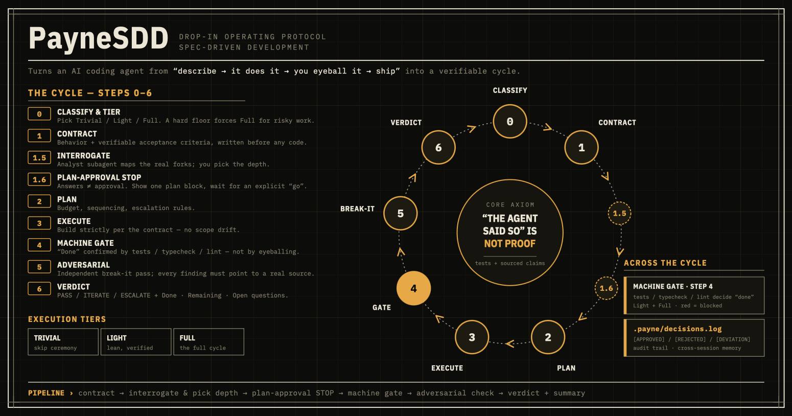
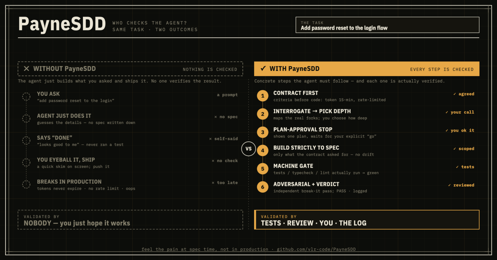

<div align="center" markdown="1">


# PayneSDD

### — "Payne, I can't feel the spec-driven development!"<br>— "Good. That means it's working."

[](LICENSE)
[](CHANGELOG.md)
[](#status)

[](https://github.com/vlr-code/PayneSDD/releases/latest)

*A drop-in operating protocol that turns an AI coding agent from*
*"describe → it does it → you eyeball it → ship"* *into a verifiable cycle.*

</div>

---

## What you get

Coding with an AI agent normally goes: **you describe a task → it writes code → you
read it over → you ship.** Most of the time that's fine. But every so often the agent
*confidently* "finishes" something subtly wrong, and you find out later — in review,
or in production. So in practice you re-check everything by hand, because the agent's
"done" doesn't mean anything on its own. That's the tax of vibe-coding through raw
prompts: speed up front, paid back as distrust.

PayneSDD is a short set of rules you paste into your agent's instructions. It gives
you three things a raw prompt doesn't:

1. **It builds what you meant, not what it guessed** — it settles the plan *with you*
   before writing a single line, so a wrong assumption dies in 30 seconds instead of
   after 200 lines you now have to unpick.
2. **"Done" actually means done** — confirmed by running the tests / the build, not
   by the agent saying so. A red check *blocks* "finished" — it can't be waved through.
3. **A second, independent agent tries to break the result** — a skeptic that must
   back every complaint with a real source (a line, a test) before anything is
   "fixed". You stop being the only safety net.

**The trade:** about a minute of up-front agreement, in exchange for code you don't
re-read line by line — plus a committed paper trail of what was decided and why. The
one idea under all of it: **"the agent said so" is not proof** — so a machine check
and a tie-to-source rule settle it instead, every time, not when the agent feels sure.

```
contract → interrogate & pick depth → plan-approval STOP → machine gate → adversarial check → verdict + summary
```

## The cycle

<div align="center" markdown="1">

</div>

| Step | What it enforces (the full rules live in [`AGENT.md`](AGENT.md)) |
|---|---|
| **0 — Classify** | Pick the tier per task: **Trivial** (just do it) / **Light** (lightweight, still gated) / **Full** (the whole cycle). A hard floor forces Full for risky work — auth, billing, migrations, anything public-facing — and when in doubt you bump up. You never pay full ceremony for a typo. |
| **1 — Contract** | Before any code: goal, **non-goals**, behavior rules, **decided** edge cases, and acceptance criteria in a testable shape — `WHEN <condition> the system SHALL <behavior>` / `IF <failure> THEN …` — each tied to a named **source of truth** (a test, a reference implementation, a golden dataset). Vague "works correctly" is banned. |
| **1.5 — Interrogate** | *(Full; Light lists the forks inline.)* An analyst subagent maps the real decision forks and hunts contradictions in the draft contract; **you** choose how much to be asked — fast / normal / thorough. A costly-to-reverse choice (stack, persistence) is never guessed silently. |
| **1.6 — Approve** | A hard **STOP** before code. Your answers were raw material, not a yes — the agent assembles one plan block and waits for an explicit "go". |
| **2 — Plan** | Sub-tasks, an iteration **budget**, escalation rules. The loop ends two ways, not one: out of tries — **or stuck**, when two iterations don't move the same failing check, so it escalates instead of looping forever. |
| **3 — Execute** | Build *exactly* the contract — no more. A **simplicity rule** bars over-engineering one implementation (no speculative abstraction or config you didn't ask for); a **duplication ratchet** stops the 2nd copy of a block and proposes extracting it. Contracted error-handling stays — the gate enforces it. |
| **4 — Machine gate** | "Done" is the machine's call, never the agent's eye. Every acceptance criterion is **mapped to the check that proves it** (an uncovered criterion is a gap, not a pass); for a runnable app, a real end-to-end run, not a by-eye glance. The check is never weakened to go green. |
| **5 — Adversarial** | An **independent** "break it" pass — a *different* agent than the one that wrote the code. Every finding must be tied to a source (a line, a doc, a test) or it's rejected. No vibes, no rubber-stamp, no fixing what can't be proven. |
| **6 — Verdict** | **PASS / ITERATE / ESCALATE**, with evidence — plus a compact **Done / Remaining / Open questions** checklist (Light + Full) so a big task never trails off into a wall of prose. |

Two things run *across* the cycle, not as one step: the **machine gate** (Step 4, on
both Light and Full) and a committed **decision log** (`.payne/decisions.log`) — the
agent writes one-line `[APPROVED]` / `[REJECTED]` / `[DEVIATION]` entries as it goes,
giving you an audit trail and cross-session memory without re-reading the chat.

## Install

Paste [`AGENT.md`](AGENT.md) into your agent's system instructions:

- **Claude Code** → `CLAUDE.md` at the repo root.
- **Other agents** (Cursor, Cline, custom) → "custom instructions" / system prompt.

That's it — the agent then follows the protocol automatically.

## Optional add-ons

The protocol in `AGENT.md` is self-contained. These are opt-in:

| File | What it adds | When |
|---|---|---|
| [`templates/SPEC.template.md`](templates/SPEC.template.md) | A fixed contract skeleton for Step 1 | Always handy |
| [`commands/payne-spec.md`](commands/payne-spec.md) | Slash command: start a contract from the template | Claude Code |
| [`commands/payne-review.md`](commands/payne-review.md) | Slash command: run the adversarial review | Claude Code |
| [`commands/payne-edit.md`](commands/payne-edit.md) | Slash command: improve PayneSDD itself — **dev mode**, default OFF | Claude Code · maintainers |
| [`agents/payne-quality.md`](agents/payne-quality.md) | Independent quality reviewer for protocol changes (dev mode) | Claude Code · maintainers |
| [`hooks/payne-gate-core.sh`](hooks/payne-gate-core.sh) | Portable gate engine — runs your test command, red = exit 1 | Any agent |
| [`hooks/payne-gate.sh`](hooks/payne-gate.sh) | Claude Code Stop-hook; blocks "done" on red tests when a spec is active | Claude Code |
| [`ROLES.md`](ROLES.md) | Multi-agent overlay (Analyst→Product→Architect→Scrum Master→Developer→QA) on Steps 0–6 | LARGE tasks only |
| [`DEPLOYMENT.md`](DEPLOYMENT.md) | Slim-core pattern: run the full protocol on a token-metered / always-on agent without paying for it every message | Chat bots · metered APIs |

### Enable the enforced gate (Claude Code)

```bash
chmod +x hooks/payne-gate.sh hooks/payne-gate-core.sh
```

```jsonc
// .claude/settings.json
{
  "env": { "PAYNE_TEST_CMD": "npm test" },
  "hooks": {
    "Stop": [
      { "hooks": [ { "type": "command",
                     "command": "$CLAUDE_PROJECT_DIR/hooks/payne-gate.sh" } ] }
    ]
  }
}
```

Per task: `touch .payne-active` when a spec is in play, `rm .payne-active` when
done. With the marker present, a red `PAYNE_TEST_CMD` blocks the agent from
finishing; with no marker the gate stays silent (trivial tasks aren't punished).

**Portability, honestly:** the *enforcement* (auto-block on stop) is Claude-Code
only. On other agents run `hooks/payne-gate-core.sh` directly — same red/green
logic, but on-request, not blocking. The lock is loosened, not removed.

## A worked example: Add password reset to the login flow

<div align="center" markdown="1">

</div>

1. **You:** *"add password reset to the login flow."*
2. **Classify + contract (Step 0–1).** Auth is on the hard floor → **Full** tier. The
   agent drafts the contract: goal, non-goals (*no SSO, no "remember me" yet*), and
   acceptance criteria pinned to tests — e.g. *WHEN the reset link is older than 1 hour
   the system SHALL reject it and show "link expired"*, *IF the email isn't registered
   THEN respond identically, with no account-enumeration leak*.
3. **Interrogate (Step 1.5).** An analyst subagent lists the real forks — token TTL?
   email provider? rate-limit? — and flags that two draft criteria conflict. You pick
   *normal* depth; it asks exactly those questions and lists the rest as defaults for
   your veto.
4. **Approve (Step 1.6).** The agent shows ONE plan block and asks *"build it or
   revise?"* — then stops. Nothing is written yet; your answers were raw material.
5. **You say "go".** It writes the **minimum that meets the contract** — no speculative
   "pluggable notifier" you didn't ask for — referencing each clause in the code.
6. **Gate (Step 4).** It shows the criterion→test map: every criterion has a test (an
   uncovered one would be a gap, not a pass). Tests run — two go red. The Stop-hook
   **blocks "finished"**; it fixes the *cause*, not the test. *(Had two tries failed to
   move the same red check, it would stop and escalate instead of looping.)*
7. **Break it (Step 5).** An *independent* subagent attacks the result and finds the
   error path leaks a different message for known vs unknown emails — tied to a line, so
   it's accepted and fixed. A vague "this feels insecure" with no source is rejected.
8. **Verdict (Step 6).** Gate green, findings adjudicated → **PASS**, with the test log
   and a **Done / Remaining / Open questions** checklist.

*Light-tier variant:* for an obvious-but-real change the agent proposes **Light** —
forks listed inline (no analyst subagent, no depth menu), a one-line *"doing X — ok?"*,
then the **same machine gate** and a short self-review, ending with the same **Done /
Remaining / Open questions** checklist. Same guarantees, a fraction of the ceremony.

## The personality is optional

`AGENT.md` ships with an optional persona — Joe, a sardonic, uncensored partner
who pushes back on lazy specs. It's flavor, not substance: strip it, swap your
own, or keep it; the protocol works identically. The rule baked into the persona:
**attitude never replaces the work** — the gate still runs, facts are never
invented, escalation stays honest.

> *Yes, "Payne" is a pun. But this is the opposite of fix-it-when-it-hurts:
> the whole point is to feel the pain at spec time, not in production.*

## Status

**Actively used on real projects, and dogfooded** — PayneSDD develops itself under its
own protocol: every change runs the full cycle and an independent review before it ships.
Latest release: **v0.4.7**.

Recent highlights:
- a **simplicity & scope** rule — write the minimum that *satisfies the contract*, don't
  over-engineer a single implementation, don't silently refactor adjacent code (0.4.6);
- the iteration loop **stops early when it's stuck**, and the built-in reviewer loads
  every file it cross-checks (0.4.5);
- acceptance criteria take a **structured, testable shape** (`WHEN … the system SHALL …`),
  the gate **maps every criterion to a check**, and the analyst hunts contract
  contradictions before any code (0.4.3);
- the machine gate **resists by-eye shortcuts** — automate the check before settling for
  soft, and prefer an executable reference to diff against (0.4.2);
- **source beats memory** — a fresh source outranks what the agent recalls, and it won't
  invent an API that isn't there (0.4.0).

Earlier: a dehydration pass (0.4.4), the `DEPLOYMENT.md` slim-core, a duplication ratchet
(0.4.0), the Done / Remaining / Open-questions summary (0.2.2), execution tiers + the
decision log (0.2.0), optional dev mode (0.3.0) and the Joe persona (0.3.1). Full history
in [`CHANGELOG.md`](CHANGELOG.md) — use it, break it, file what doesn't hold.

## License

[MIT](LICENSE) © 2026 vlr-code
